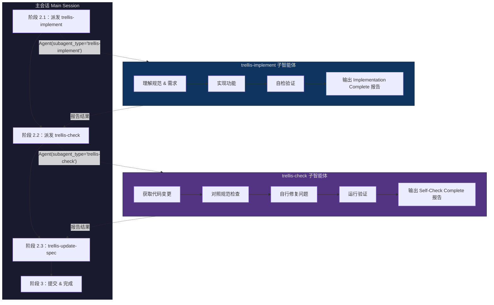
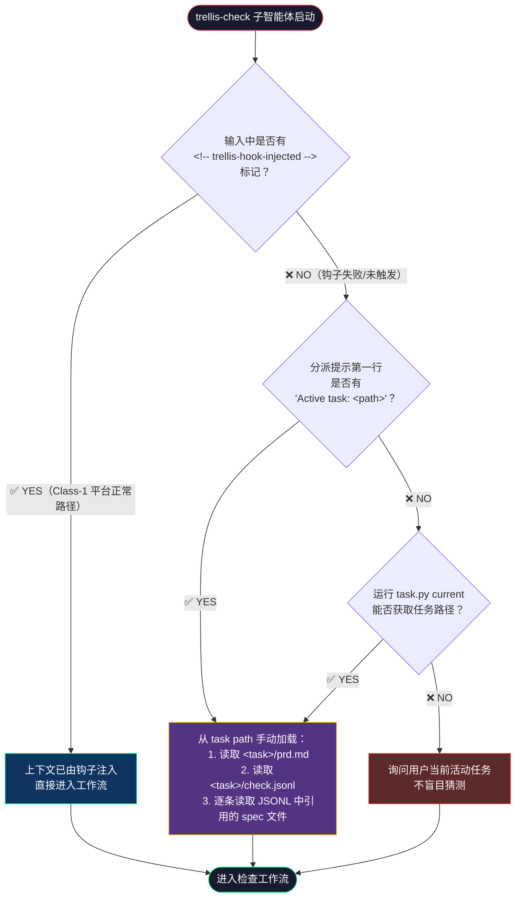
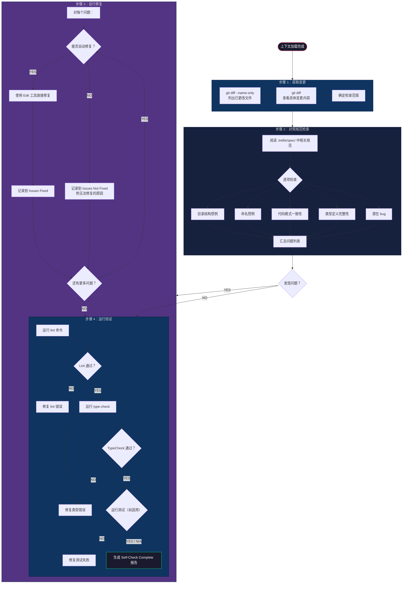
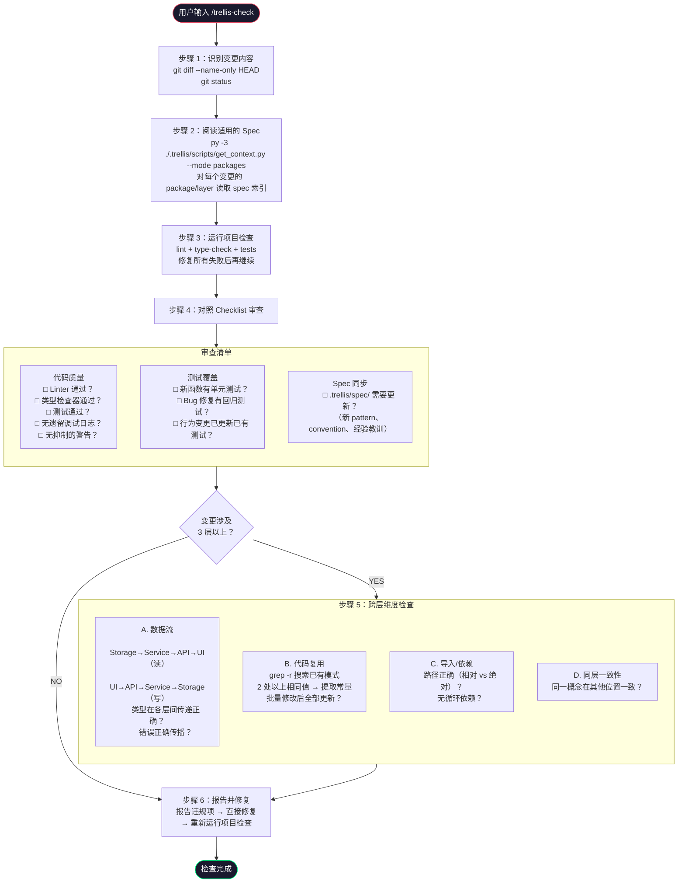
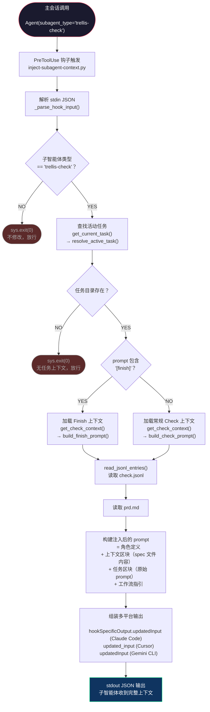
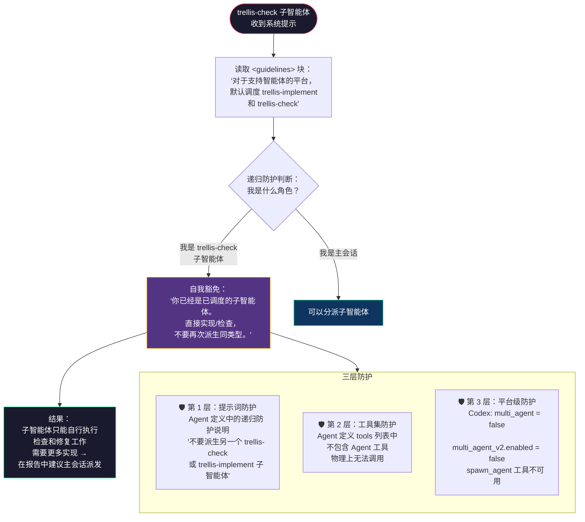
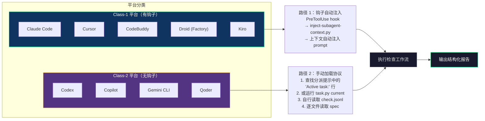
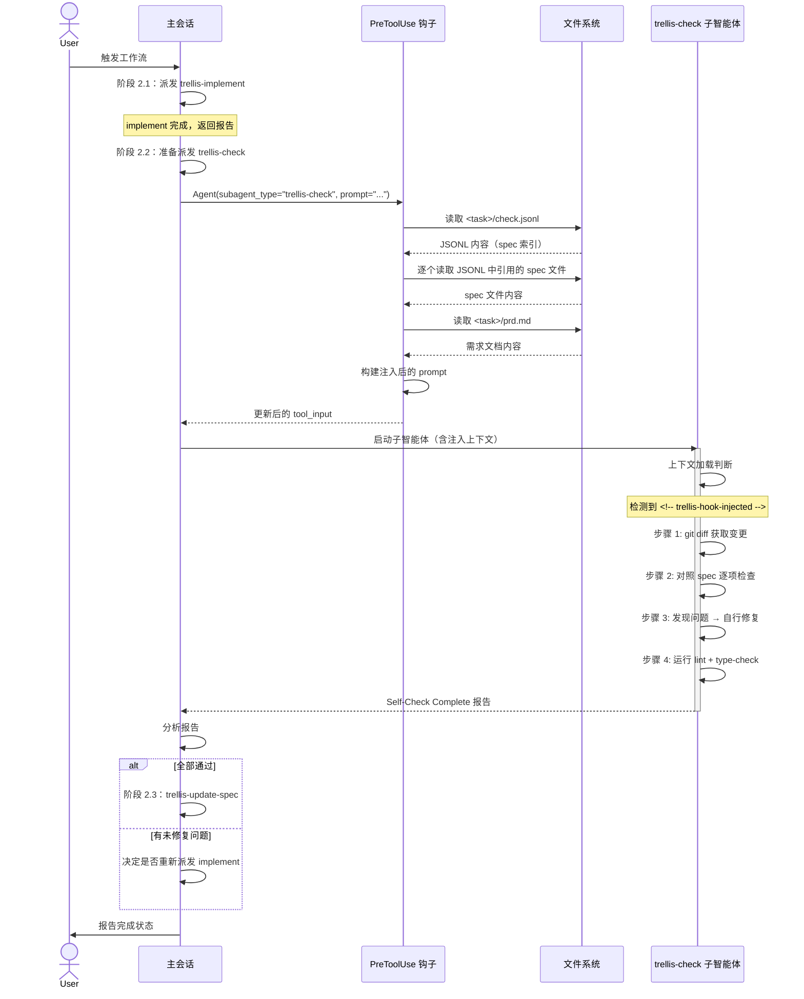
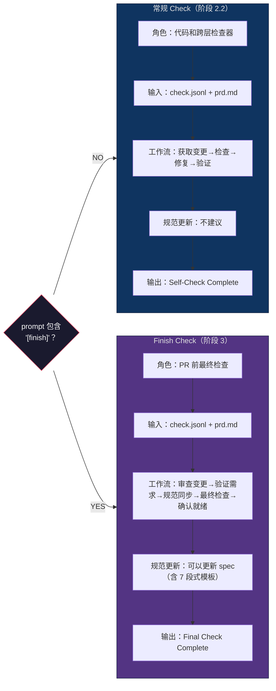
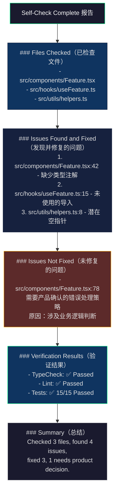

# trellis-check 智能体流程图

> 使用 Mermaid 语法绘制的完整流程图集。
> 在支持 Mermaid 的 Markdown 渲染器中查看（GitHub、VS Code + 插件、Typora 等）。

---

## 图一：整体架构 — trellis-check 在 Trellis 工作流中的位置

---

## 图二：trellis-check 上下文加载决策树

---

## 图三：四步检查工作流（核心流程）

---

## 图四：Skill 模式下的六步工作流

---

## 图五：PreToolUse 钩子上下文注入流程

---

## 图六：递归防护机制

---

## 图七：平台适配路径对比

---

## 图八：完整生命周期时序图

---

## 图九：Finish 阶段 vs 常规 Check 对比

---

## 图十：报告格式数据结构

---

## 图例

| 颜色 | 含义 |
|------|------|
| 🟣 紫色 (`#533483`) | trellis-check 相关 |
| 🔵 蓝色 (`#0f3460`) | 系统/平台相关 |
| ⬛ 深色 (`#1a1a2e`) | 入口/出口节点 |
| 🟢 绿色边框 (`#00ff88`) | 成功/正常路径 |
| 🟠 橙色边框 (`#ffaa00`) | 降级/手动路径 |
| 🔴 红色边框 (`#ff4444`) | 错误/需要用户介入 |
