# trellis-implement 智能体流程图

> 使用 Mermaid 语法绘制的完整流程图集。
> 在支持 Mermaid 的 Markdown 渲染器中查看（GitHub、VS Code + 插件、Typora 等）。

---

## 图一：整体架构 — trellis-implement 在 Trellis 工作流中的位置

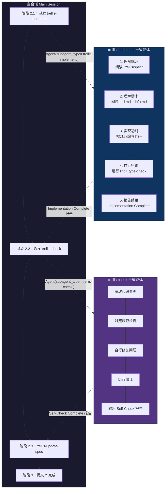

---

## 图二：上下文加载决策树

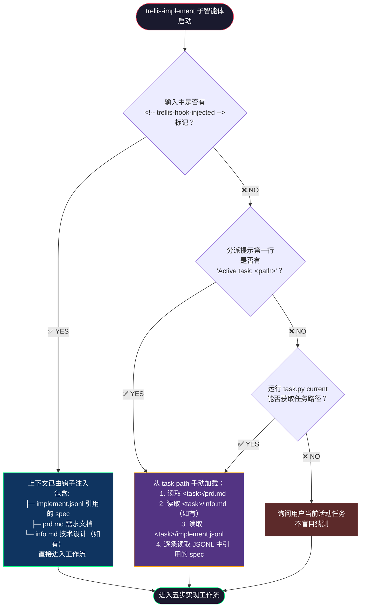

---

## 图三：五步实现工作流（核心流程）

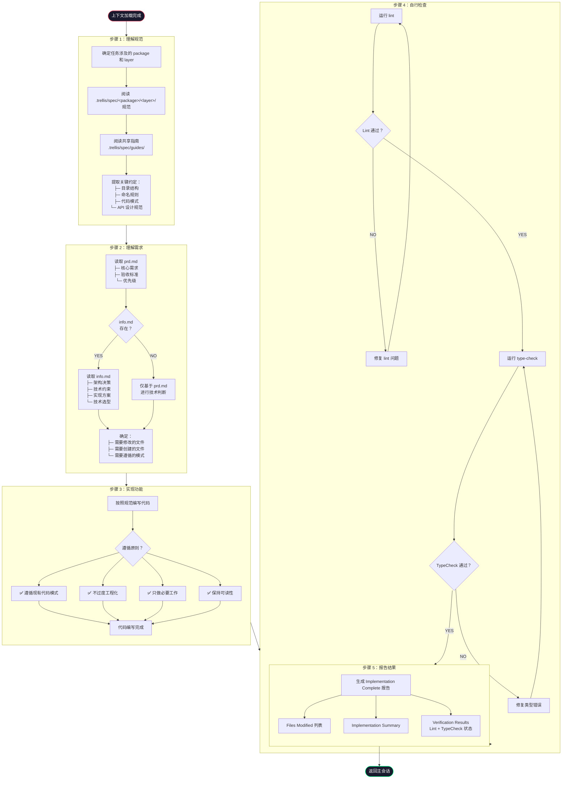

---

## 图四：PreToolUse 钩子上下文注入流程（Implement 视角）

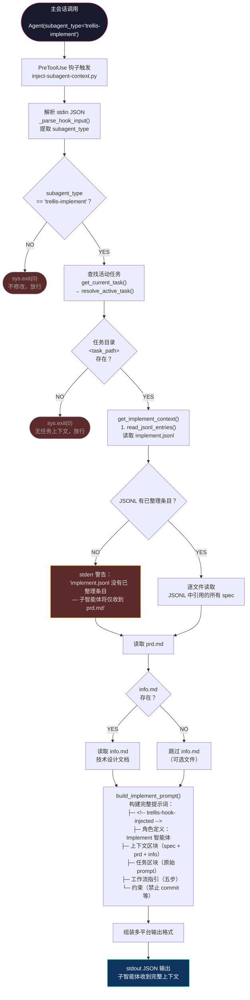

---

## 图五：Implement 与 Check 上下文加载对比

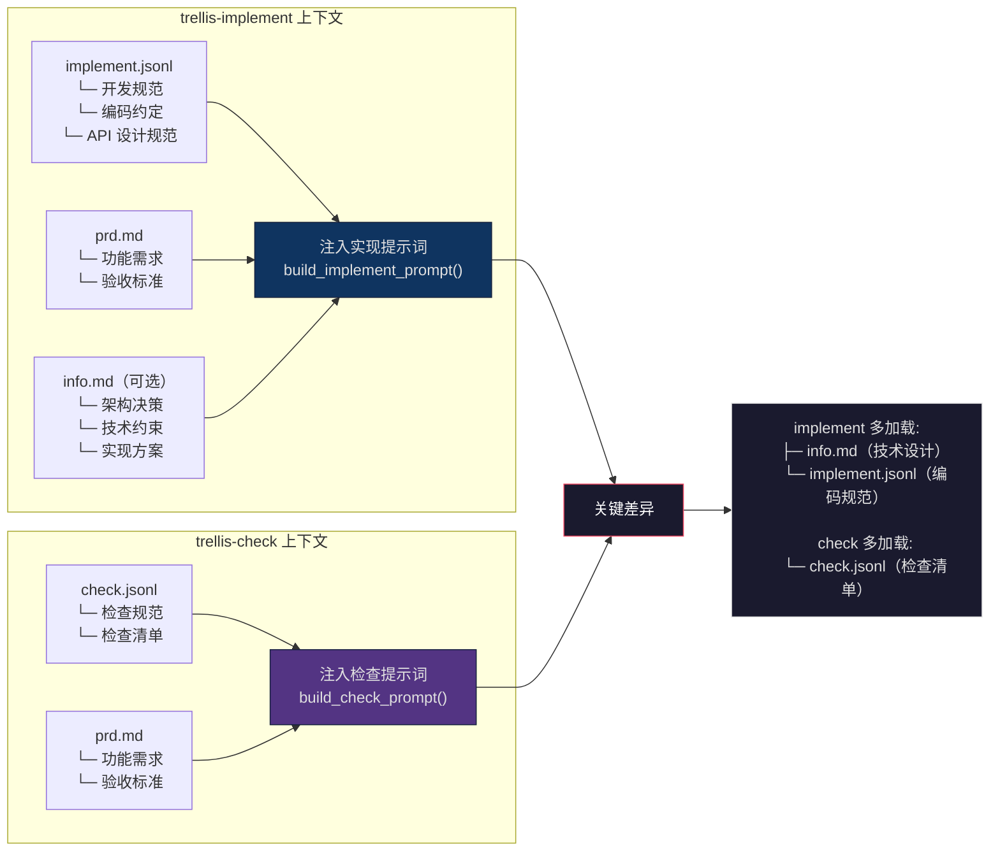

---

## 图六：禁止操作与权限边界

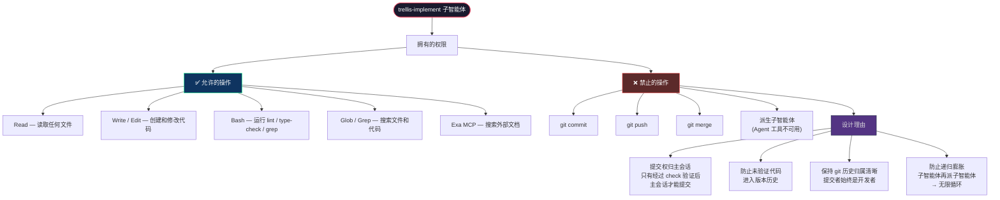

---

## 图七：Implement → Check 双智能体循环

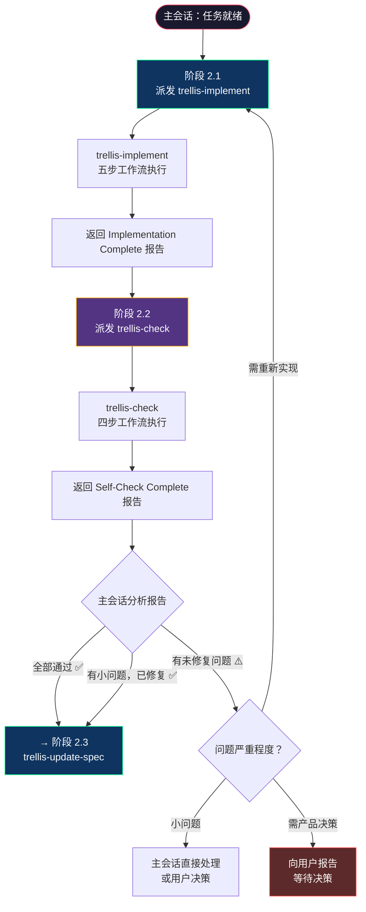

---

## 图八：完整生命周期时序图

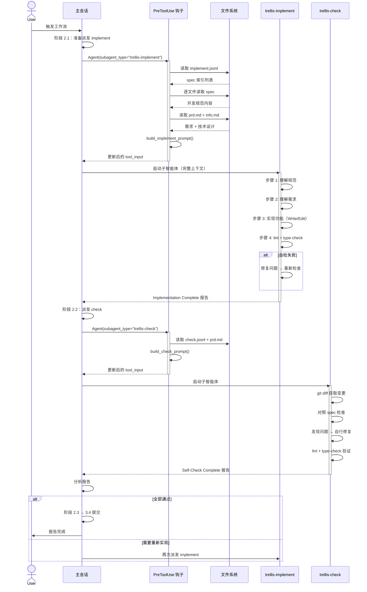

---

## 图九：平台适配路径对比

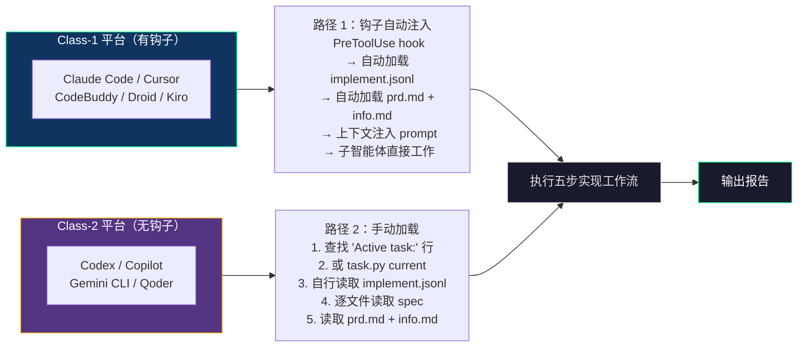

---

## 图十：报告格式数据结构

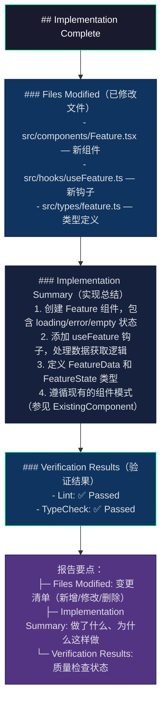

---

## 图十一："不过度工程化"原则的决策流程

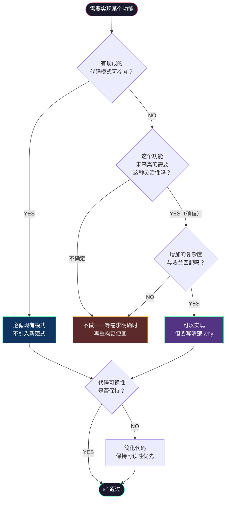

---

## 图例

| 颜色 | 含义 |
|------|------|
| 🔵 蓝色 (`#0f3460`) | trellis-implement 相关 / 正常路径 |
| 🟣 紫色 (`#533483`) | trellis-check 相关 / 降级路径 |
| ⬛ 深色 (`#1a1a2e`) | 入口/出口/判断节点 |
| 🟢 绿色边框 (`#00ff88`) | 成功/正常路径标记 |
| 🟠 橙色边框 (`#ffaa00`) | 降级/手动加载路径 |
| 🔴 红色边框/背景 (`#ff4444`/`#5c2a2a`) | 禁止操作/错误/需要用户介入 |
