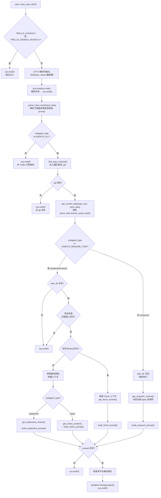
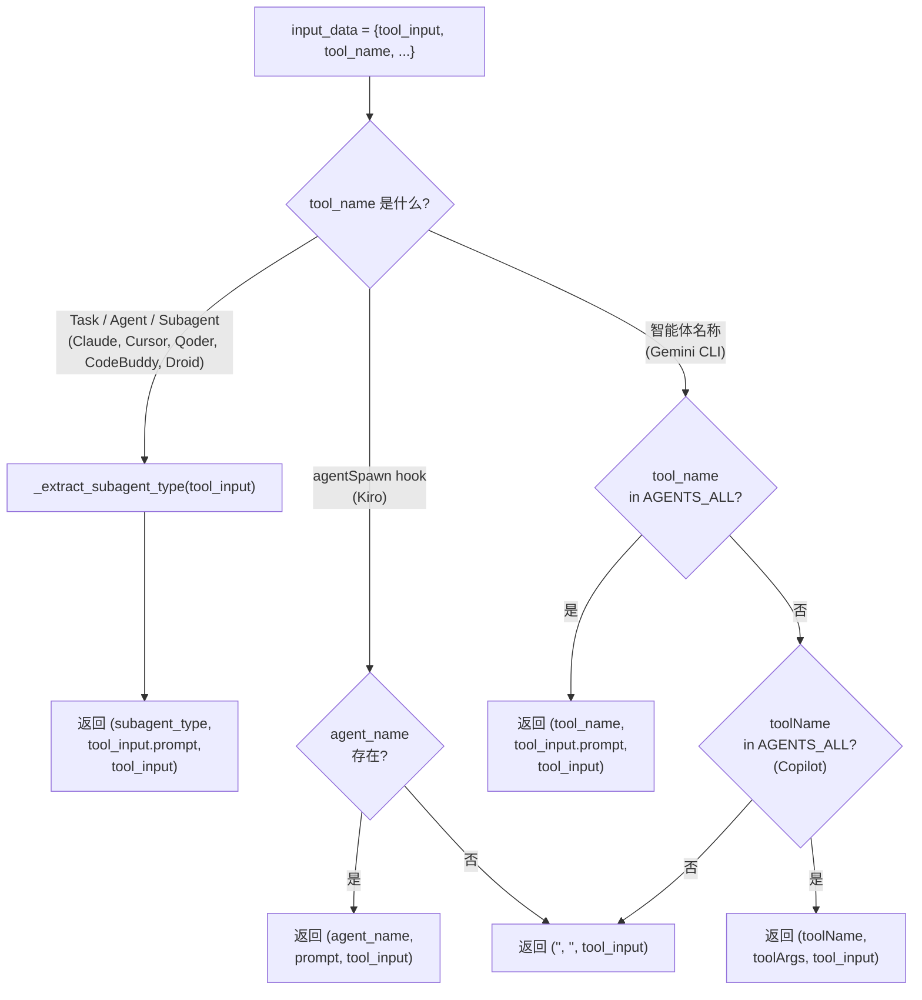
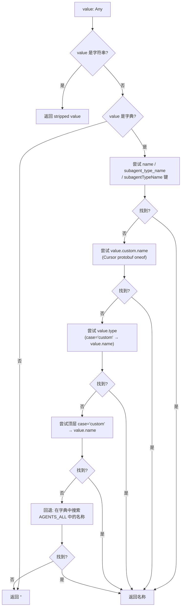
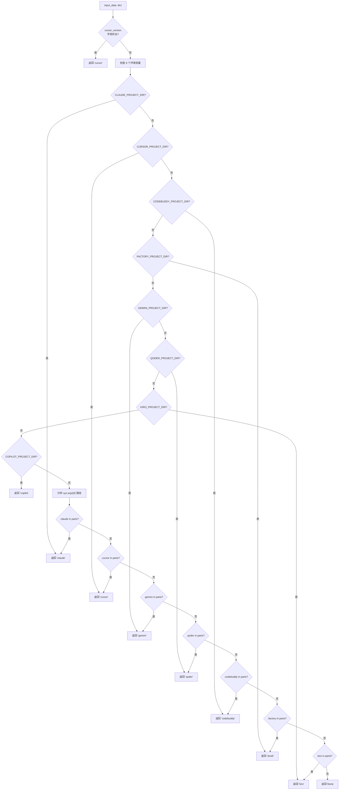
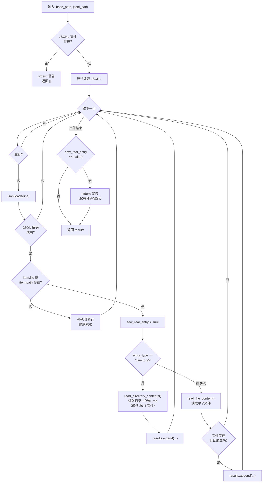
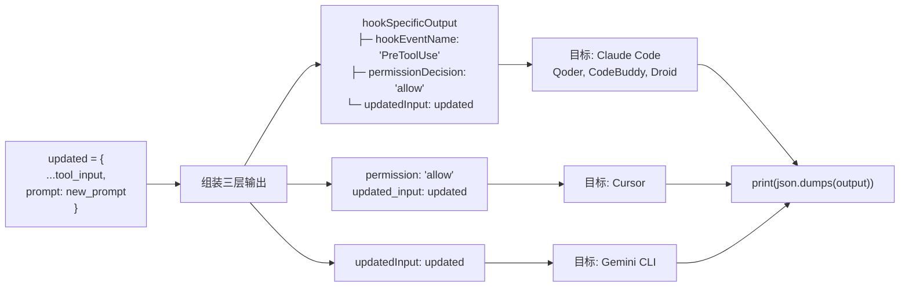
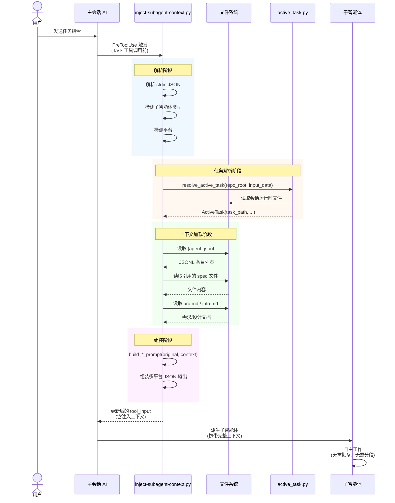
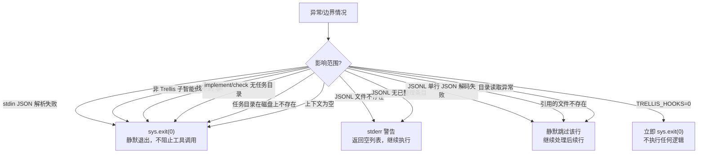
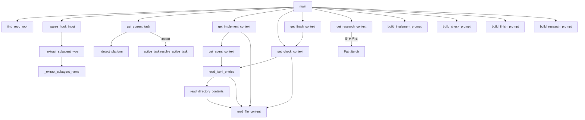

# inject-subagent-context.py 流程图

> 可在 GitHub、Mermaid Live Editor 或任何支持 Mermaid 的 Markdown 渲染器中查看。

---

## 1. 总体执行流程

---

## 2. 钩子输入解析 `_parse_hook_input()`

---

## 3. 子智能体名称提取 `_extract_subagent_name()`

---

## 4. 平台检测 `_detect_platform()`

---

## 5. JSONL 上下文解析 `read_jsonl_entries()`

---

## 6. 各智能体上下文构建

```mermaid
flowchart TD
    subgraph IMPLEMENT["Implement 智能体"]
        I1["get_implement_context()"] --> I2["① read_jsonl_entries('implement.jsonl')<br/>开发规范、编码约定"]
        I2 --> I3["② read_file_content('prd.md')<br/>需求文档"]
        I3 --> I4["③ read_file_content('info.md')<br/>技术设计文档"]
        I4 --> I5["build_implement_prompt()<br/>组装: 角色 + 上下文 + 任务 + 工作流"]
    end

    subgraph CHECK["Check 智能体"]
        C1["get_check_context()"] --> C2["① read_jsonl_entries('check.jsonl')<br/>检查规范、检查清单"]
        C2 --> C3["② read_file_content('prd.md')<br/>需求文档（验证用）"]
        C3 --> C4["build_check_prompt()<br/>组装: 角色 + 上下文 + 任务 + 自修复工作流"]
    end

    subgraph FINISH["Finish 阶段（Check 变体）"]
        F1["get_finish_context()"] --> F2["复用 get_check_context()<br/>check.jsonl + prd.md"]
        F2 --> F3["build_finish_prompt()<br/>组装: PR 前最终检查 + 规范同步"]
    end

    subgraph RESEARCH["Research 智能体"]
        R1["get_research_context()"] --> R2["① 动态扫描 .trellis/spec/<br/>构建目录树"]
        R2 --> R3["② 添加搜索提示<br/>(Glob, Grep, Exa, ...)"]
        R3 --> R4["build_research_prompt()<br/>组装: 查找和解释信息 + 严格边界"]
    end
```

---

## 7. 输出格式适配

---

## 8. 三类智能体完整时序图

---

## 9. 错误处理决策树

---

## 10. 函数调用关系图

---

## 图例

| 符号 | 含义 |
|------|------|
| `{}` | 条件判断（菱形） |
| `[]` | 处理步骤（矩形） |
| `()` | 开始/结束（圆角矩形） |
| `→` | 流程方向 |
| `-->>` | 返回/响应 |
| 彩色背景 | 逻辑分组 |
