# inject-workflow-state.py 流程图

> 可在 GitHub、Mermaid Live Editor 或任何支持 Mermaid 的 Markdown 渲染器中查看。

---

## 1. 总体执行流程

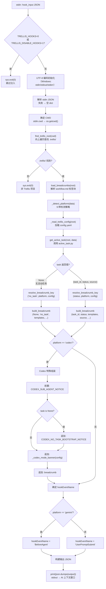

---

## 2. 平台检测详细流程

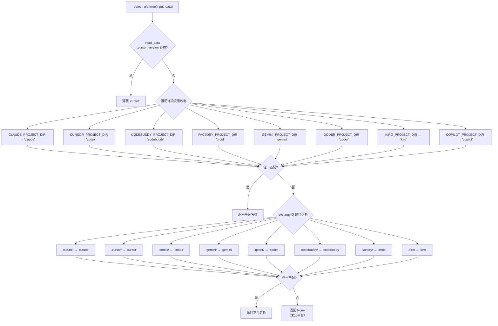

---

## 3. Trellis 根目录发现流程

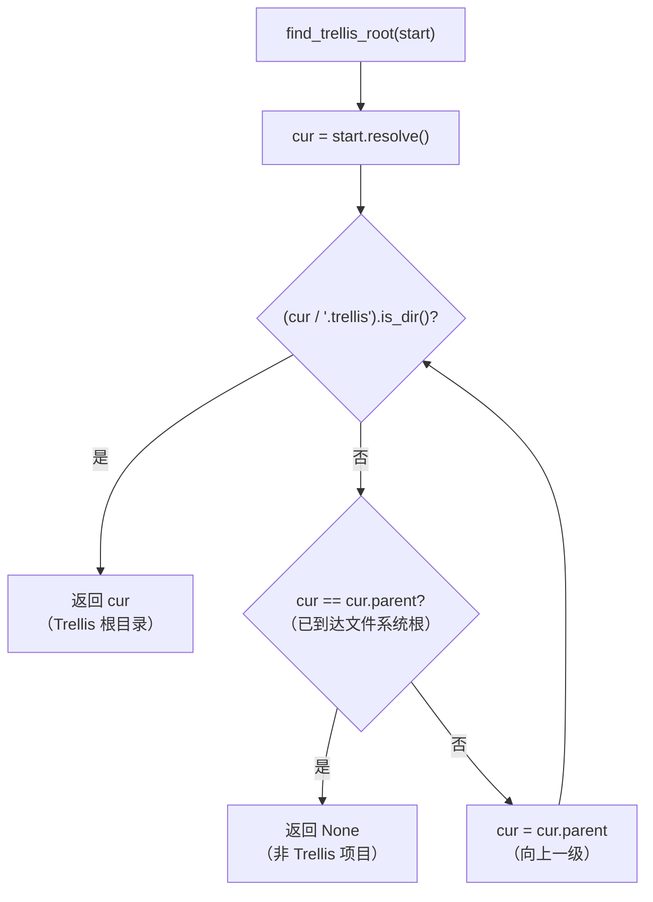

---

## 4. 活动任务解析详细流程

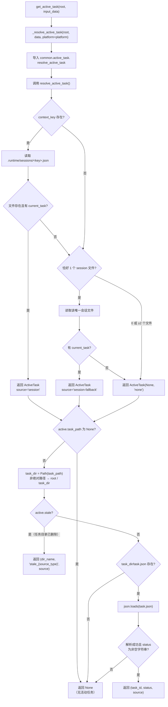

---

## 5. 面包屑模板加载流程

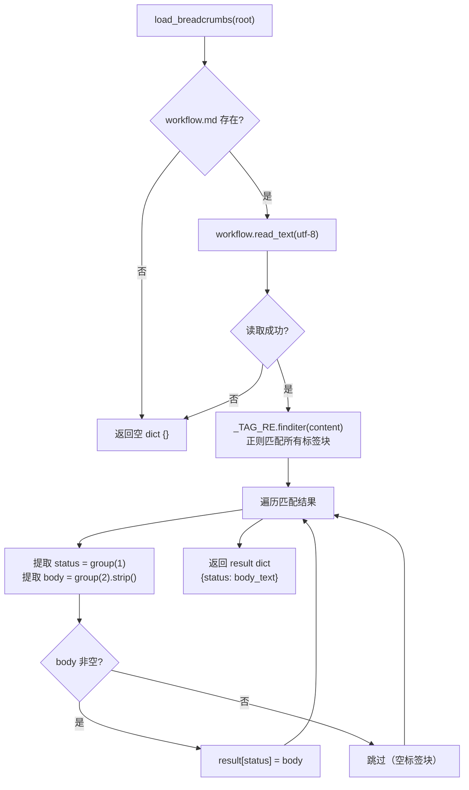

### 5.1 正则表达式说明

```
_TAG_RE = re.compile(
    r"\[workflow-state:([A-Za-z0-9_-]+)\]\s*\n"   ← 开始标签，捕获 STATUS
    r"(.*?)"                                        ← 正文（非贪婪）
    r"\n\s*\[/workflow-state:\1\]",                 ← 结束标签，反向引用验证配对
    re.DOTALL,                                       ← . 匹配换行符
)
```

### 5.2 workflow.md 标签块结构

```
┌─────────────────────────────────────────────┐
│ workflow.md                                 │
├─────────────────────────────────────────────┤
│                                             │
│  [workflow-state:no_task]                   │
│  - 无活跃 task。                             │
│  **A 直接回答** — 纯粹的问答...              │
│  **B 先建任务** — ...                       │
│  **C 内联修改** — ...                       │
│  [/workflow-state:no_task]                  │
│                                             │
│  [workflow-state:planning]                  │
│  加载 `trellis-brainstorm` 技能...          │
│  阶段 1.3（必需，一次）...                   │
│  [/workflow-state:planning]                 │
│                                             │
│  [workflow-state:planning-inline]           │
│  加载 `trellis-brainstorm` 技能...          │
│  在内联派发模式下，阶段 1.3 被跳过...        │
│  [/workflow-state:planning-inline]          │
│                                             │
│  [workflow-state:in_progress]               │
│  **流程**：trellis-implement → ...          │
│  [/workflow-state:in_progress]              │
│                                             │
│  [workflow-state:in_progress-inline]        │
│  **流程**（内联模式）：主 session 加载...    │
│  [/workflow-state:in_progress-inline]       │
│                                             │
│  [workflow-state:completed]                 │
│  代码已通过阶段 3.4 提交...                  │
│  [/workflow-state:completed]                │
│                                             │
└─────────────────────────────────────────────┘
```

---

## 6. Codex 面包屑键解析流程

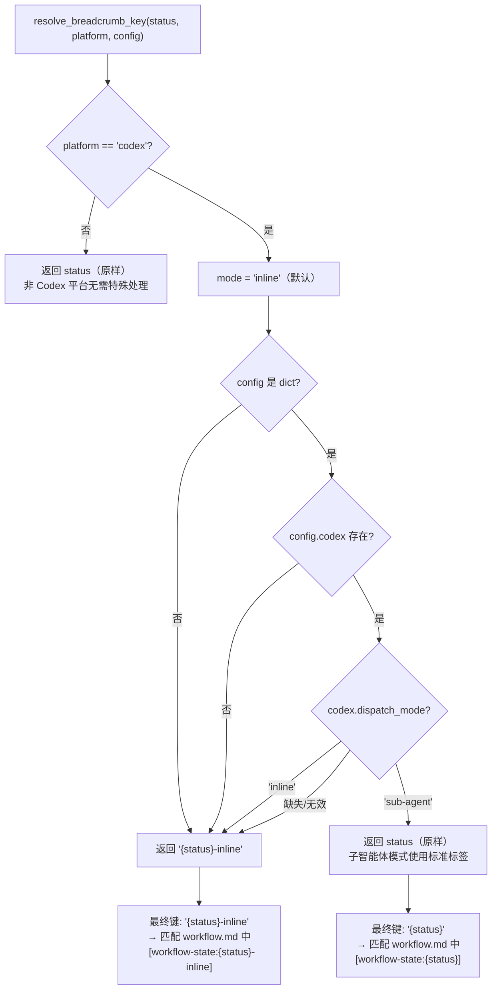

---

## 7. 面包屑构建流程

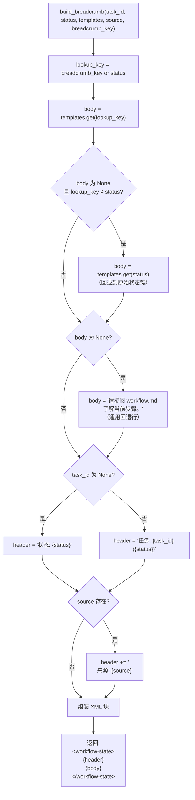

### 7.1 输出示例

**有活动任务（标准平台）**：
```xml
<workflow-state>
任务: trellis-python (in_progress)
来源: session-fallback:claude_d77f67d7-b3a3-4e90-baf3-cf3c89491de9
**流程**：trellis-implement → trellis-check → trellis-update-spec → 提交（阶段 3.4）→ `/trellis:finish-work`。
...
</workflow-state>
```

**无活动任务（标准平台）**：
```xml
<workflow-state>
状态: no_task
- 无活跃 task。
**A 直接回答** — 纯粹的问答 / 解释 / 查找 / 聊天...
**B 先建任务** — ...
**C 内联修改** — ...
</workflow-state>
```

**Codex 完整输出（无任务 + inline 模式）**：
```xml
<sub-agent-notice>
子智能体通知 — 如果通过 spawn_agent 派生，请先阅读
...
</sub-agent-notice>

<trellis-bootstrap>
你正在 Trellis 管理的 Codex 会话中运行，当前没有活动任务。
...
</trellis-bootstrap>

<codex-mode>inline</codex-mode>

<workflow-state>
状态: no_task
...
</workflow-state>
```

---

## 8. Gemini 事件名选择流程

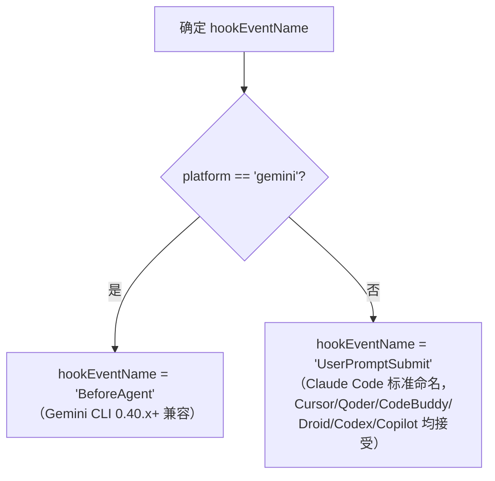

---

## 9. 完整数据流（输入端 → 输出端）

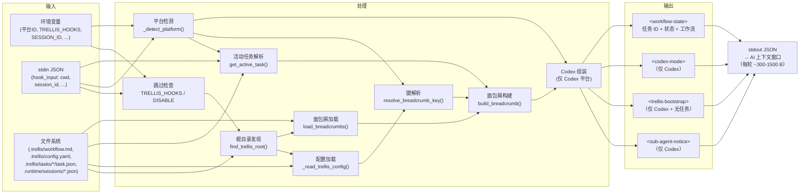

---

## 10. 时序图：UserPromptSubmit 钩子生命周期

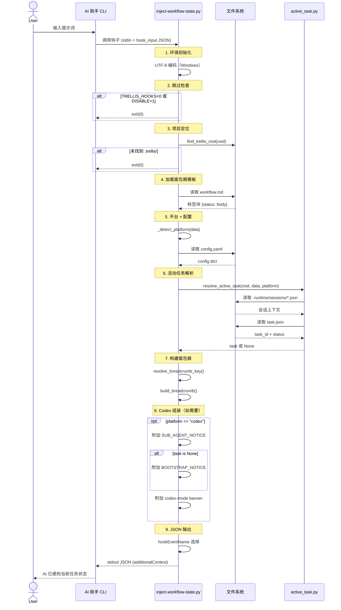

---

## 11. 类图：核心数据结构

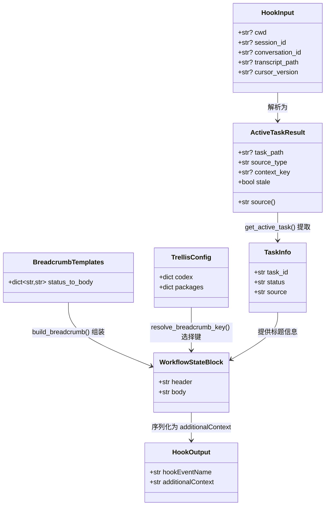

---

## 12. 状态到面包屑映射全景图

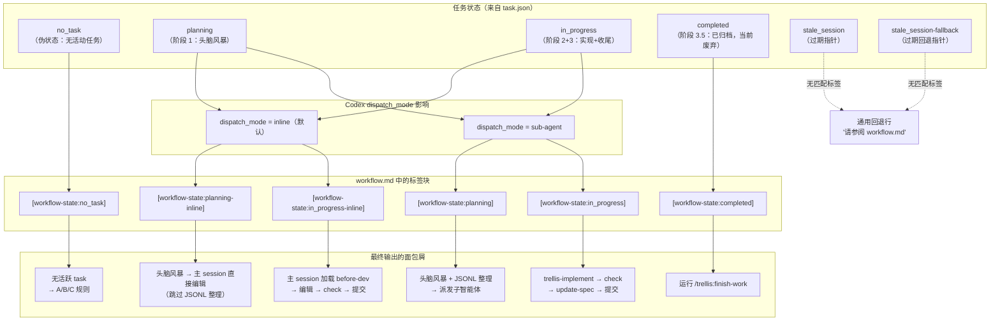

---

## 附录：关键常量和阈值

| 常量 | 值 | 位置 |
|------|-----|------|
| 跳过环境变量 | `TRELLIS_HOOKS=0` 或 `TRELLIS_DISABLE_HOOKS=1` | `main()` 第 323 行 |
| 标签正则 | `\[workflow-state:([A-Za-z0-9_-]+)\]\s*\n(.*?)\n\s*\[/workflow-state:\1\]` | `_TAG_RE` 第 200 行 |
| Codex 默认 dispatch_mode | `inline` | `resolve_breadcrumb_key()` 第 287 行 |
| Gemini hook 事件名 | `BeforeAgent` | `main()` 第 367 行 |
| 其他平台 hook 事件名 | `UserPromptSubmit` | `main()` 第 367 行 |
| 面包屑回退文本 | `请参阅 workflow.md 了解当前步骤。` | `build_breadcrumb()` 第 311 行 |
| 支持平台数 | 9 个（Claude/Cursor/Codex/Qoder/CodeBuddy/Droid/Gemini/Kiro/Copilot） | `_detect_platform()` 第 122 行 |
| Kiro 支持 | 无每轮 hook 入口点（写入了 hooks 目录但未接线） | 文件头部注释 |
