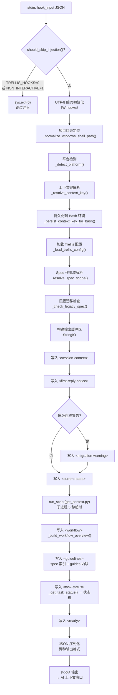
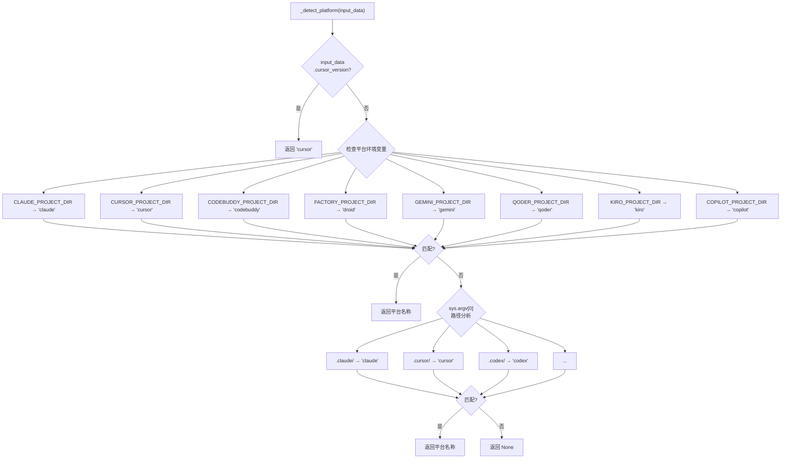
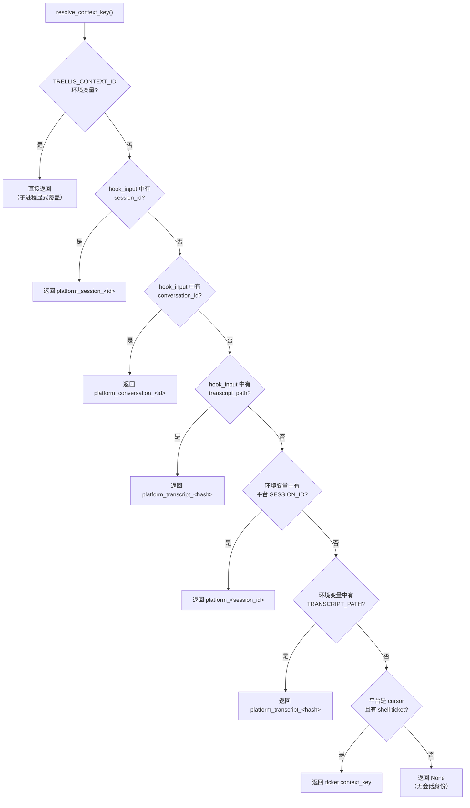
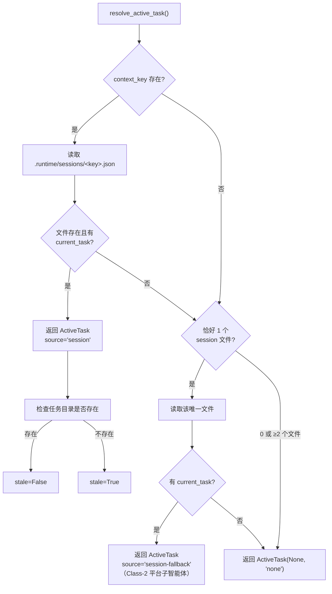
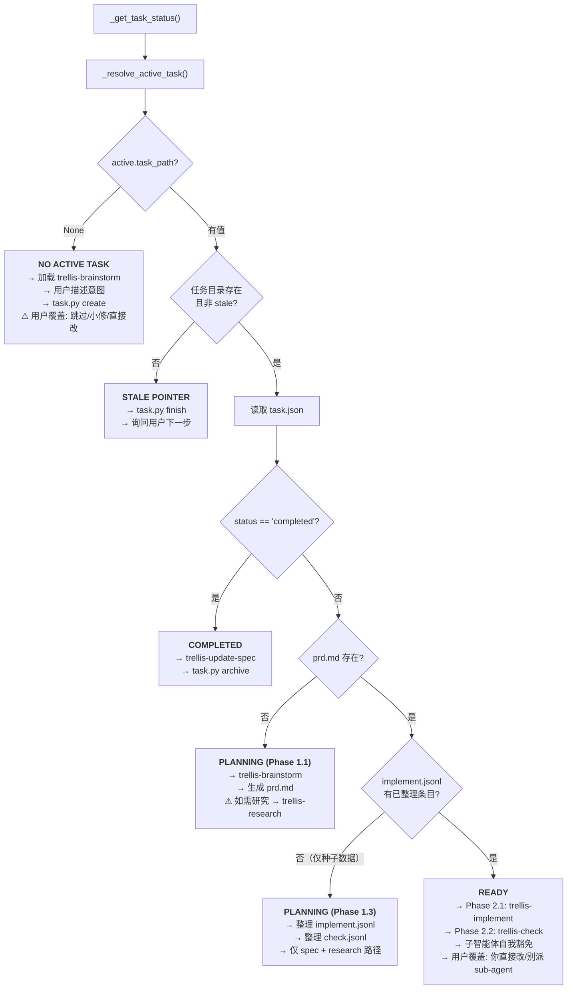
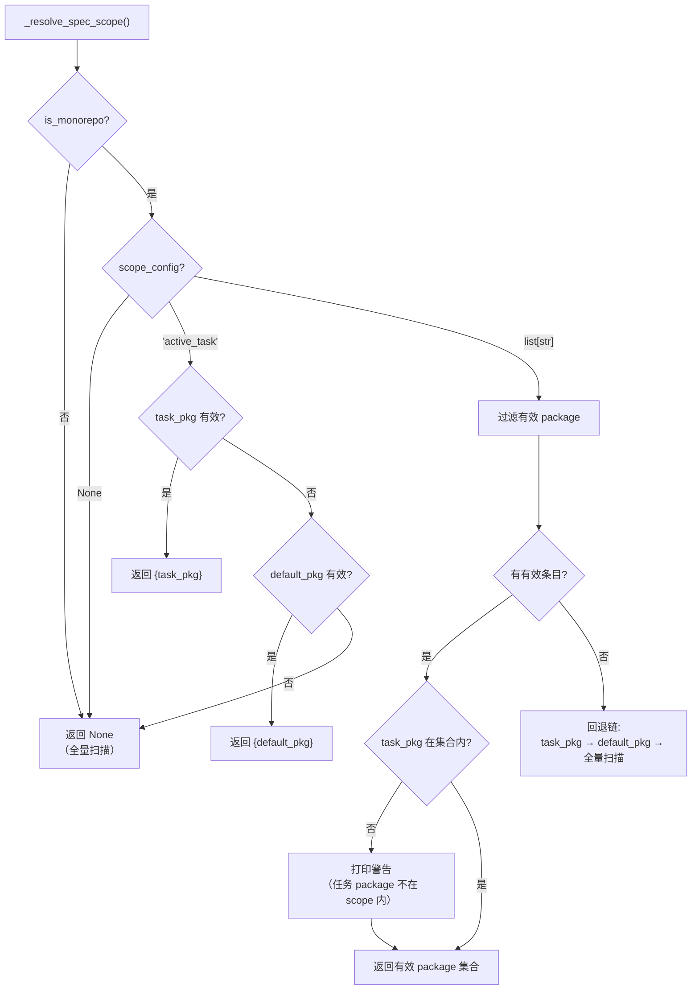
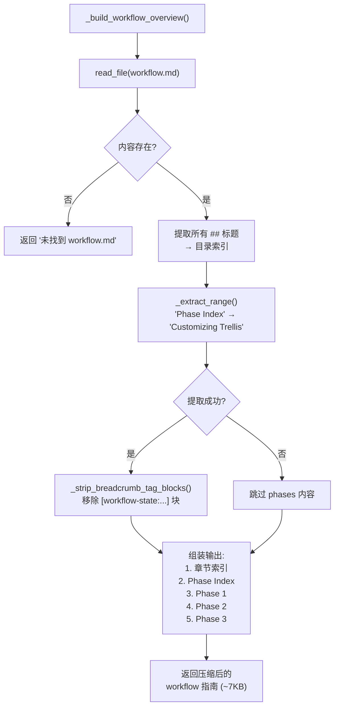
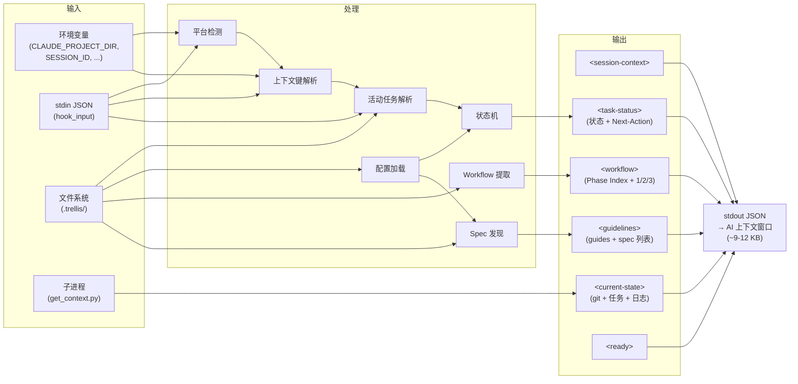
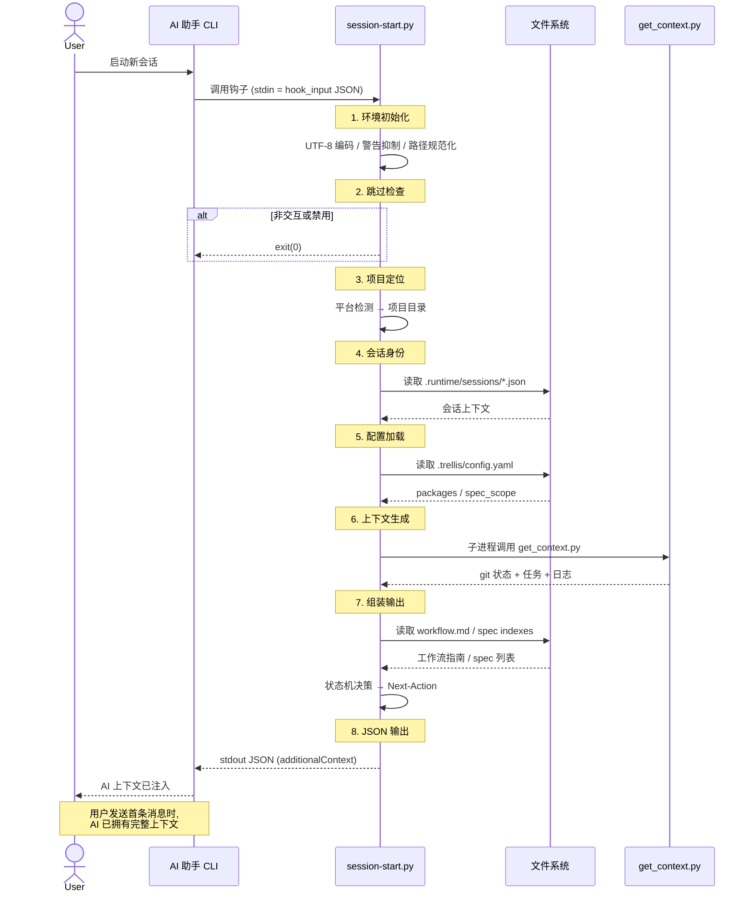
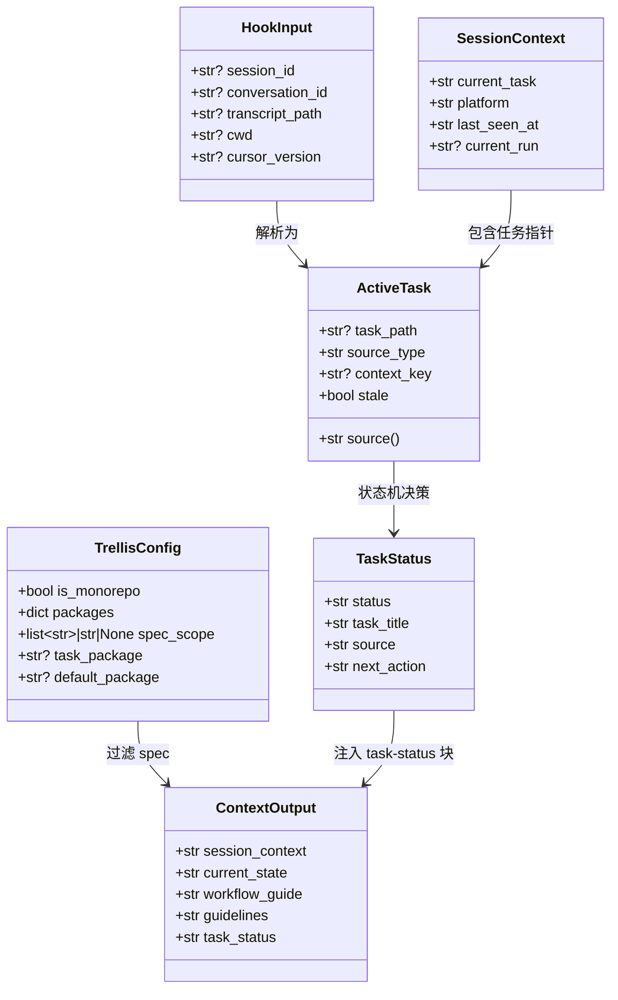

# session-start.py 流程图

> 可在 GitHub、Mermaid Live Editor 或任何支持 Mermaid 的 Markdown 渲染器中查看。

---

## 1. 总体架构流程

---

## 2. 平台检测流程

---

## 3. 上下文键解析流程

---

## 4. 活动任务解析流程（含 session-fallback）

---

## 5. 任务状态机（核心决策）

---

## 6. Spec 作用域解析

---

## 7. Workflow 指南构建

---

## 8. 完整数据流（输入端 → 输出端）

---

## 9. 时序图：SessionStart 钩子生命周期

---

## 10. 类图：核心数据结构

---

## 附录：关键常量和阈值

| 常量 | 值 | 位置 |
|------|-----|------|
| 子进程超时 | 5 秒 | `run_script()` |
| 会话键最大长度 | 160 字符 | `active_task.py:_sanitize_key()` |
| Cursor shell ticket TTL | 30 秒 | `active_task.py:CURSOR_SHELL_TICKET_TTL_SECONDS` |
| Workflow 注入预算 | ~9 KB | `_build_workflow_overview()` |
| 总上下文预算 | ~9-12 KB | 最终输出 |
| WebFetch 内联上限 | 10 次 | `_get_task_status()` 研究提醒 |
| 日志文件最大行数 | 2000 | `config.py:DEFAULT_MAX_JOURNAL_LINES` |
| Session auto-commit 默认 | True | `config.py:DEFAULT_SESSION_AUTO_COMMIT` |
